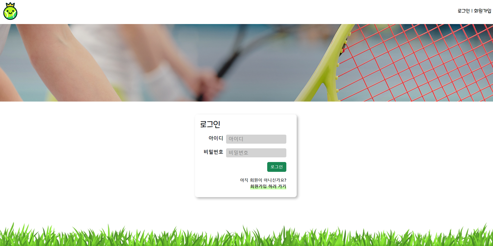

# FINAL PJT

## 작성정보
날짜:2023.11.24 
팀장:배유열 
팀원:문성현 
환경:windows 10 pro 
개발도구: Visual Studio Code, Spring Boot 
협업 도구 : Github

## 프로젝트 개요

### FINAL PJT

## 팀원 및 PJT 수행 목록

<table align="center">
    <tr align="center">
        <td style="min-width: 220px;">
            <a href="https://github.com/seonghyeon-m">
              
               
              <b>문성현</b>
            </a> 
        </td>
        <td style="min-width: 220px;">
            <a href="https://github.com/yuyeoul">
              
               
              <b>배유열 </b>
            </a>
        </td>
    </tr>
    <tr align="center">
        <td>
          Front-end 
         
        </td>
        <td>
          Back-end 
           
        </td>
    </tr>
</table>

 
 

## 프로젝트 구현 사항

#### 기능 설명
- 메인페이지: 남녀 랭킹 순 출력. 이름, 점수, 매칭현황 확인 가능. 각 유저 클릭 시 유저 상세페이지로 이동.
- 회원가입: 신규 회원 가입. 아이디, 비밀번호, 핸드폰 번호에 대한 유효성 검사가 진행된다.
- 로그인: 회원 로그인.
- 유저 상세페이지: 해당 유저의 랭킹, 성별, 나이, 주소, 점수 표시. 신청하기 버튼을 눌러 매칭 신청 가능.
- 검색 결과페이지: 사용자 이름 기준으로 검색한 결과를 출력. 각 유저 클릭 시 유저 상세페이지로 이동.
- 마이페이지
  - 나의 정보: 나의 정보 확인.
  - 비밀번호 변경: 로그인 된 유저의 비밀번호 변경 가능.
  - 우편함
    - 받은 요청: 다른 유저로부터 들어온 요청 확인. 요청 수락 및 거절 가능.
    - 보낸 요청: 다른 유저에게 보낸 요청 확인. 요청 취소 가능.
  - 진행중인 매칭: 다른 유저와 현재 성사된 매칭, 과거 상대방과의 경기 결과 확인. 현재 경기의 결과를 입력, 전송 가능.
  - 과거 매칭기록: 과거 나의 경기 결과 확인.

#### 프로젝트 폴더 구조
 
 

#### ERD Table 
 

#### Class Diagram  
 

#### ✔ PJT 구현 화면

#### 메인 페이지
 
 

 
매칭중인 유저는 매칭 현황이 변경된다.  

#### 회원가입
 
아이디, 비밀번호, 핸드폰 번호에 대한 유효성 검사가 진행된다.  

#### 로그인
 
 
로그인에 성공하면 로그인, 회원가입 버튼은 사라지며, 현재 로그인 된 사용자의 이름과 마이페이지, 로그아웃 버튼이 나타난다. 

#### 유저 상세페이지
 
매칭 신청 버튼이 활성화 되어있다.  

 
다른 성별의 사용자 
매칭 신청 버튼이 비활성화 된다.  

 
본인 
매칭 신청 버튼이 비활성화 된다.  

 
이미 매칭중인 유저 
매칭 신청 버튼이 비활성화 된다.  

#### 검색 결과페이지
 
검색 결과에서도 해당 유저를 누르면 유저 상세페이지로 이동 가능하다.  
 
검색 결과가 없으면 대체 화면이 출력된다.  

#### 마이페이지
 
로그인 된 사용자의 정보를 보여준다.  

 
사용자에게 들어온 매칭 요청을 보여준다. 
수락 버튼을 누르면 현재 진행중인 매치가 생긴다. 
거절 버튼을 누르면 매치가 거절된다.  

 
사용자가 다른 사용자에게 보낸 매칭 요청을 확인할 수 있다. 
취소 버튼을 누르면 요청을 취소할 수 있다.  

 
나의 정보와 상대방의 정보가 구분되어 출력된다. 
나와 상대방 사이의 과거 경기 기록이 하단 좌측에 출력되고, 
하단 우측에는 이번에 진행중인 매치의 결과를 입력할 수 있는 창이 있다. 
여기서 경기 결과를 입력한 후 전송하면 메인 페이지에서 확인할 수 있는 나의 점수가 승패에 따라 업데이트 된다.  

 
점수는 ELO 알고리즘에 의해 변동된다.  

 
진행중인 매칭이 존재하지 않으면 대체 텍스트가 출력된다.  

 
나의 과거 경기기록을 볼 수 있는 화면이다.  